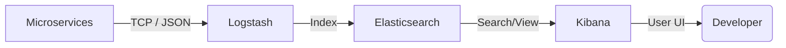

# 📊 ELK Stack Local Integration Guide (Non-Docker)

This guide explains how to set up and use the ELK Stack (Elasticsearch, Logstash, Kibana) locally on Windows for centralized logging of your microservices.

---

## 🏗️ 1. How it Works (Architecture)

In a non-dockerized environment, the logging flow works as follows:



1.  **Microservices**: Use the `logstash-logback-encoder` to format logs as JSON and send them via TCP to Logstash.
2.  **Logstash (Port 5044)**: Listens for incoming logs, parses them (if needed), and pushes them into Elasticsearch.
3.  **Elasticsearch (Port 9200)**: The search engine and database that stores the log data.
4.  **Kibana (Port 5601)**: The web interface used to search, visualize, and analyze the logs stored in Elasticsearch.

---

## 🛠️ 2. Manual Installation Steps

Since we are avoiding Docker, follow these steps to install the components in your `SOFTWARE_INSTALLED` directory:

### A. Elasticsearch
1.  **Download**: [Elasticsearch 8.x for Windows](https://www.elastic.co/downloads/elasticsearch) (ZIP).
2.  **Extract**: To `SOFTWARE_INSTALLED\elasticsearch`.
3.  **Run**: `.\bin\elasticsearch.bat`.
4.  **Verify**: Open `http://localhost:9200`.

### B. Logstash
1.  **Download**: [Logstash 8.x for Windows](https://www.elastic.co/downloads/logstash) (ZIP).
2.  **Extract**: To `SOFTWARE_INSTALLED\logstash`.
3.  **Config**: Create `SOFTWARE_INSTALLED\logstash\config\logstash-springboot.conf` (see below).
4.  **Run**: `.\bin\logstash.bat -f .\config\logstash-springboot.conf`.

### C. Kibana
1.  **Download**: [Kibana 8.x for Windows](https://www.elastic.co/downloads/kibana) (ZIP).
2.  **Extract**: To `SOFTWARE_INSTALLED\kibana`.
3.  **Run**: `.\bin\kibana.bat`.
4.  **Verify**: Open `http://localhost:5601`.

---

## ⚙️ 3. Configuration Files

### Logstash Configuration (`logstash-springboot.conf`)
Place this in your Logstash config folder:
```json
input {
  tcp {
    port => 5044
    codec => json_lines
  }
}

output {
  elasticsearch {
    hosts => ["http://localhost:9200"]
    index => "microservices-logs-%{+YYYY.MM.dd}"
  }
  stdout { codec => rubydebug }
}
```

---

## 🚀 4. Spring Boot Integration

To send logs to ELK, we need to add a dependency and a logback configuration to **each microservice**.

### Step 1: Add Dependency (`pom.xml`)
```xml
<dependency>
    <groupId>net.logstash.logback</groupId>
    <artifactId>logstash-logback-encoder</artifactId>
    <version>7.4</version>
</dependency>
```

### Step 2: Add Logback Appender (`logback-spring.xml`)
Create this file in `src/main/resources`:
```xml
<?xml version="1.0" encoding="UTF-8"?>
<configuration>
    <include resource="org/springframework/boot/logging/logback/base.xml"/>

    <appender name="LOGSTASH" class="net.logstash.logback.appender.LogstashTcpSocketAppender">
        <destination>localhost:5044</destination>
        <encoder class="net.logstash.logback.encoder.LogstashEncoder" />
    </appender>

    <root level="INFO">
        <appender-ref ref="CONSOLE" />
        <appender-ref ref="LOGSTASH" />
    </root>
</configuration>
```

---

## ⚡ 5. Integration with `run_all.bat`

Once installed, we will update the master script to start these components:

```batch
:: Start ELK Stack
echo [ELK] Starting Elasticsearch...
start "ELASTICSEARCH" /D "%SOFTWARE_DIR%\elasticsearch" cmd /k "bin\elasticsearch.bat"
ping 127.0.0.1 -n 15 >nul

echo [ELK] Starting Logstash...
start "LOGSTASH" /D "%SOFTWARE_DIR%\logstash" cmd /k "bin\logstash.bat -f config\logstash-springboot.conf"
ping 127.0.0.1 -n 15 >nul

echo [ELK] Starting Kibana...
start "KIBANA" /D "%SOFTWARE_DIR%\kibana" cmd /k "bin\kibana.bat"
```
