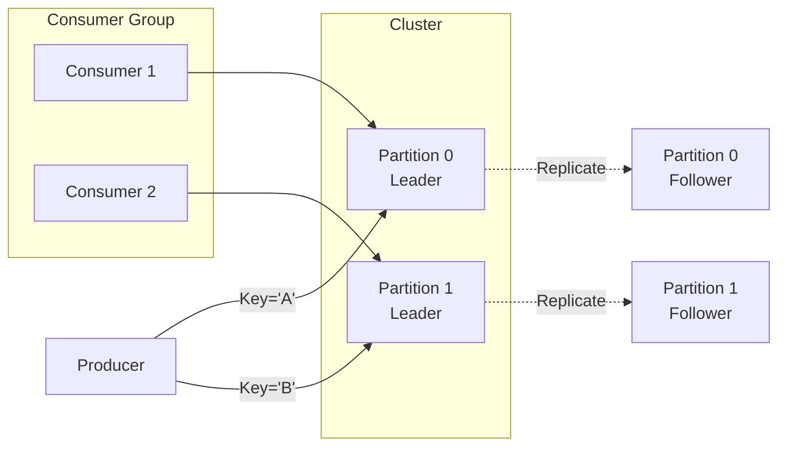

# 🎓 Apache Kafka: The Ultimate Mastery Guide

Apache Kafka is a **Distributed Event Streaming Platform**. Think of it as a highly scalable, fault-tolerant "Digital Nervous System" for your microservices.

---

## 1. The Core Infrastructure

### 🏢 Broker
A **Broker** is a single Kafka server. It receives messages from producers, stores them on disk, and serves them to consumers.
> [!NOTE]
> One Kafka server = 1 Broker.

### 🏘️ Cluster
A **Cluster** is a group of one or more Brokers working together. This is where Kafka's power of "Distributed" comes from. If one broker fails, others take over.

### 🗺️ Zookeeper / KRaft
Kafka needs a coordinator to manage the cluster.
*   **Zookeeper**: The traditional way (used in your project). It manages broker lists, partitions, and leader elections.
*   **KRaft**: The new way (Kafka 3.0+) that eliminates the need for Zookeeper.

---

## 2. Basic Data Units

### ✉️ Message (Event)
A message is a record of something that happened. It consists of:
1.  **Key**: (Optional) Used for partitioning and log compaction.
2.  **Value**: The actual data (usually JSON or String).
3.  **Timestamp**: When it was created.
4.  **Headers**: Metadata (like tracing IDs).

### 🏷️ Topic
A **Topic** is a logical folder name for messages. For example: `user-visits`, `payment-events`.
*   Topics are **append-only** (you can't delete a message in the middle).
*   Messages are kept for a set time (default 1 week).

### 🍰 Partition
This is the most important concept. A Topic is split into **Partitions**.
*   **Parallelism**: If a topic has 3 partitions, 3 consumers can read at the exact same time.
*   **Ordering**: Ordering is only guaranteed **within a single partition**, not across the whole topic.

---

## 3. The Players (Roles)

### 📤 Producer
The component that sends data to Kafka.
*   **Partitioning Rule**:
    *   **No Key**: Round-robin distribution (or sticky).
    *   **With Key**: All messages with the same key (e.g., `user-123`) always go to the **same partition**.

### 📥 Consumer
The component that reads data from Kafka.
*   Consumers **Pull** data (poll). Kafka doesn't push data to them.
*   **Offset**: A unique ID for each message in a partition. The Consumer tracks which offset it last read so it can resume after a crash.

### 👥 Consumer Group
A logical collection of consumers working together to process a topic.
*   **Rule 1**: Only one consumer in a group can read from a specific partition at a time.
*   **Rule 2**: If you have more consumers than partitions, the extra ones will sit **idle**.
*   **Scaling**: To handle more traffic, increase partitions and add more consumers to the same group.

---

## 4. Advanced Reliability

### 👑 Leader vs Follower
Each partition has one **Leader** and multiple **Followers**.
*   All reads and writes go to the Leader.
*   Followers purely copy data from the leader (Replication).
*   If the Leader dies, a Follower is elected as the new Leader.

### 📢 Acks (Acknowledgement)
Producers decide how "safe" they want to be:
*   `acks=0`: Fire and forget. No confirmation (fast but risky).
*   `acks=1`: Leader must receive the message (standard).
*   `acks=all`: All replicas must receive the message (safest).

---

## 5. 💡 Interview Perspective: Pro Tips

### Q1: How does Kafka achieve high scalability?
**Answer**: Through **Partitions**. By splitting a topic into multiple partitions across different brokers, multiple producers can write and multiple consumers can read in parallel.

### Q2: What happens if a consumer in a group crashes?
**Answer**: **Rebalancing**. Kafka detects the failure and reassigns the partitions that the dead consumer was reading to the remaining healthy consumers in the group.

### Q3: Why is Kafka so fast despite saving data to disk?
**Answer**:
1.  **Sequential I/O**: It appends data to the end of files (much faster than random disk access).
2.  **Zero Copy**: It moves data from the disk directly to the network buffer without the CPU touching it.

### Q4: Can two consumers in the same group read from the same partition?
**Answer**: **No**. This is how Kafka ensures that messages in a partition are processed in order and not duplicated within a single logical group.

---

## 6. Visualization

---

*This document belongs in the project root to guide your learning.*
