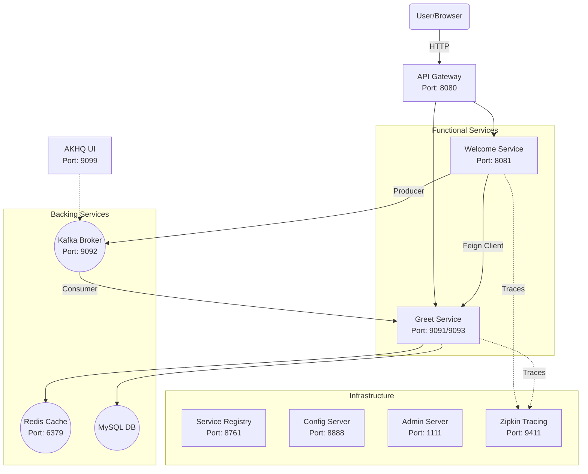

# 📘 Microservices Ecosystem - Project Knowledge Transfer (KT)

## 1. Executive Summary
This project is a **production-grade Microservices Architecture** built with **Spring Boot 3** and **Spring Cloud**. It simulates a real-world distributed system where services communicate synchronously (REST/Feign) and asynchronously (Kafka), while being managed by central infrastructure for configuration, discovery, and observability.

---

## 2. High-Level Architecture

---

## 3. Component Inventory

### A. Infrastructure Services
| Service Name | Port | Purpose | Key Tech |
| :--- | :--- | :--- | :--- |
| **Config Server** | `8888` | Centralized Configuration management. Stores `application.properties` for all services. | Spring Cloud Config |
| **Service Registry** | `8761` | "Phonebook" of the system. Services register here so they can find each other by name. | Netflix Eureka |
| **API Gateway** | `8080` | The single entry point. Routing, Security, and Load Balancing. | Spring Cloud Gateway |
| **Admin Server** | `1111` | Monitoring dashboard for all Spring Boot apps (Health, Metrics, Logs). | Spring Boot Admin |
| **Zipkin** | `9411` | Distributed Tracing. Visualizes the path of a request across services. | Zipkin (Standalone) |

### B. Functional Services
| Service Name | Port | Role | Features |
| :--- | :--- | :--- | :--- |
| **Welcome Service** | `8081` | **Consumer / Orchestrator**. Receives user requests and calls other services. | • **Feign Client**: Sync call to Greet. • **Kafka Producer**: Sends "Visit" events. • **Load Balancing**: Distributes Kafka keys. |
| **Greet Service** | `9091` `9093` | **Provider / Worker**. Handles core logic and data storage. | • **JPA/MySQL**: Persists data. • **Redis**: Caches responses. • **Kafka Consumer**: Listens to "Visit" events. |

### C. External Tools (Installed Locally)
| Tool | Port | Use Case |
| :--- | :--- | :--- |
| **Kafka** | `9092` | Event Streaming Platform. |
| **Zookeeper** | `2181` | Manages Kafka Cluster state. |
| **Redis** | `6379` | In-memory Cache (Key-Value store). |
| **AKHQ** | `9099` | **Web UI for Kafka**. Used to view topics and produce messages. |

---

## 4. Key Workflows explained

### Flow 1: The "Hello" Request (Synchronous)
**Goal**: Get a greeting message.
1.  User hits `http://localhost:8080/welcome-service/welcome`.
2.  **API Gateway** looks up "welcome-service" in Eureka and forwards request to Port 8081.
3.  **Welcome Service** receives request.
    *   It uses **Feign Client** to call `http://greet-service/greet`.
4.  **Binder (Eureka)** tells Feign that `greet-service` is at `localhost:9091`.
5.  **Greet Service** checks **Redis Cache**.
    *   *Hit*: Returns cached greeting.
    *   *Miss*: Fetches from MySQL, saves to Redis, returns greeting.
6.  **Welcome Service** combines response and returns to User.

### Flow 2: The "User Visit" Event (Asynchronous)
**Goal**: Log that a user visited, without slowing down the response.
1.  Inside the same `/welcome` endpoint in Welcome Service...
2.  **KafkaProducerService** generates a **Random UUID Key**.
    *   *Why?* To ensure load balancing across partitions.
3.  Sends message: `"User visited..."` to Topic `user-visits` (Partition 0 or 1).
4.  **Greet Service** (Consumer) picks up the message immediately.
    *   It extracts Metadata (Topic, Partition, Offset).
    *   It logs the event (simulating a background job like Analytics).

---

## 5. How to Run & Verify

### One-Click Startup
We created a master script `run-all.bat` that:
1.  Fixes Windows path issues (`subst Z:`).
2.  Starts Zookeeper, Kafka, Redis, Zipkin, AKHQ.
3.  Starts all Microservices in the correct order.

### Verification Points
1.  **Eureka Dashboard**: `http://localhost:8761` (See all apps UP).
2.  **Zipkin Tracing**: `http://localhost:9411` (Search for traces).
3.  **AKHQ Kafka UI**: `http://localhost:9099` (See `user-visits` topic).
4.  **Test URL**: `http://localhost:8080/welcome-service/welcome`

---

## 6. Design Decisions (Why we did this?)
*   **No Docker**: Per your request, everything is "native". We used `subst` to handle Windows path limits for Kafka.
*   **Random Keys in Kafka**: To prevent the "Sticky Partitioner" problem where only one consumer was working.
*   **Central Config**: All `application.properties` are managed by Config Server, mimicking Production.
